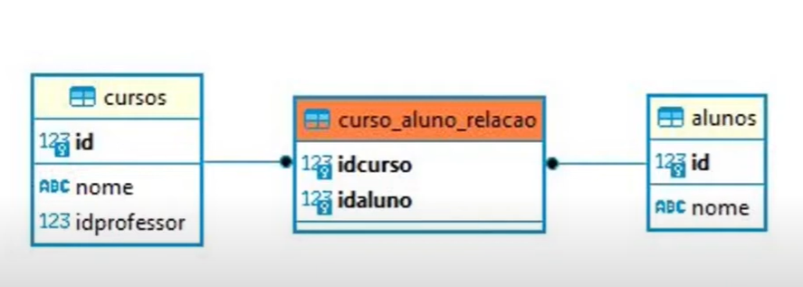

# CHAVES ESTRANGEIRAS NO POSTGRESQL (PARTE 02)

## CHAVES ESTRANGEIRAS

É uma coluna de uma tabela que faz referência a chave primária de outra tabela.

## SINTAXE

```
    FOREIGN KEY (nome_do_campo_tabela_atual) REFERENCES nome_da_tabela_extra (nome_do_campo_da_tabela_extra)
```

## CARDINALIDADE N x N



Nesse relacionamento, basicamente está sendo dito isso: Muitos alunos fazem vários cursos, assim como muitos cursos contém muitos alunos.

## PRÁTICA

```
----------

EXEMPLO 01: CRIANDO NOVA TABELA ALUNO

CREATE TABLE alunos (
	id serial primary key,
	nome varchar(100) not null
);

----------

EXEMPLO 02: CRIANDO TABELA DE RELAÇÃO ENTRE ALUNOS E CURSOS.

CREATE TABLE curso_aluno_relacao(
	idaluno integer not null,
	idcurso integer not null,

	FOREIGN KEY (idaluno) REFERENCES alunos(id),
	FOREIGN KEY (idcurso) REFERENCES cursos(id),
	PRIMARY KEY(idaluno, idcurso) -- Criando uma PK a partir de dois campos.
);

----------

EXEMPLO 03: INSERINDO VALORES NA TABELA ALUNOS. 

insert into alunos (nome) values ('Thiago');
insert into alunos (nome) values ('Gabriela');

select * from alunos;

----------

EXEMPLO 04: INSERINDO VALORES NA TABELA DE RELAÇÃO.

insert into curso_aluno_relacao values (1, 1); (idaluno, idcurso)
insert into curso_aluno_relacao values (2, 1);
insert into curso_aluno_relacao values (2, 2);
insert into curso_aluno_relacao values (2, 2); -- Esse insert vai dar erro, pois um mesmo insert com os mesmo dados já foi inserido com sucesso, ou seja, o nosso banco já valida dados duplicados.
insert into curso_aluno_relacao values (3, 1); -- Nosso banco já valida campos inexistentes. Esse insert deu erro pois ele não insere dados em campos que não existem.

select * from curso_aluno_relacao;

----------
```