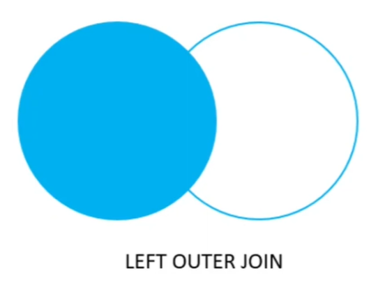

# LEFT JOIN NO POSTGRESQL

## LEFT JOIN

Usamos o comando LEFT JOIN quando precisamos criar um select que busca os dados em mais de uma tabela.

## SINTAXE

SELECT *
FROM tabela_a
LEFT JOIN tabela_b ON condicao_para_juncao;

## DIFERENÇAS ENTRE INNER JOIN X LEFT JOIN


O INNER JOIN pega somente os valores das duas tabelas que, de fato, estão dentro da condição criadas para a junção delas.



O LEFT JOIN pega os valores das duas tabelas que, de fato, estão dentro da condição criadas para a junção delas e, também, todos os registros da tabela 'à esquerda' (tabela_a).

## PRÁTICA

```
----------

EXEMPLO:

SELECT cursos.nome AS curso, professores.nome AS educador 
FROM cursos LEFT JOIN professores ON professores.id = cursos.idprofessor;

- Neste Exemplo, ele vai trazer todos os registros que tem ligação entre as duas tabelas, juntamente com todos os registros da tabelas 'CURSOS'.

----------
```

